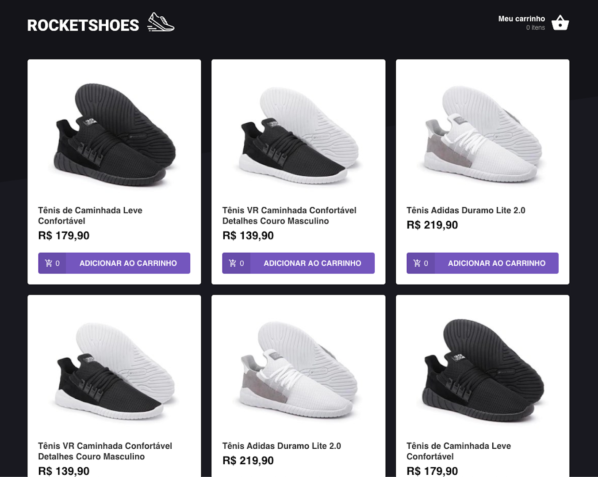
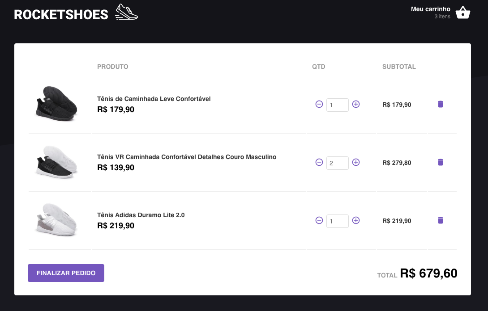

# Rocketshoes

Exemplo de loja criado com React e Redux-Saga

:point_right: [Live Demo](https://andreenakashima.netlify.com/)

## Instalação

1. Clone este repositório
2. Entre na pasta usando `cd Rocketshoes`
3. Instale as dependências com o comando `yarn`
4. Rode a aplicação usando `yarn start`

## Licença

Projeto sob a licença [:memo: MIT](LICENSE.md).
